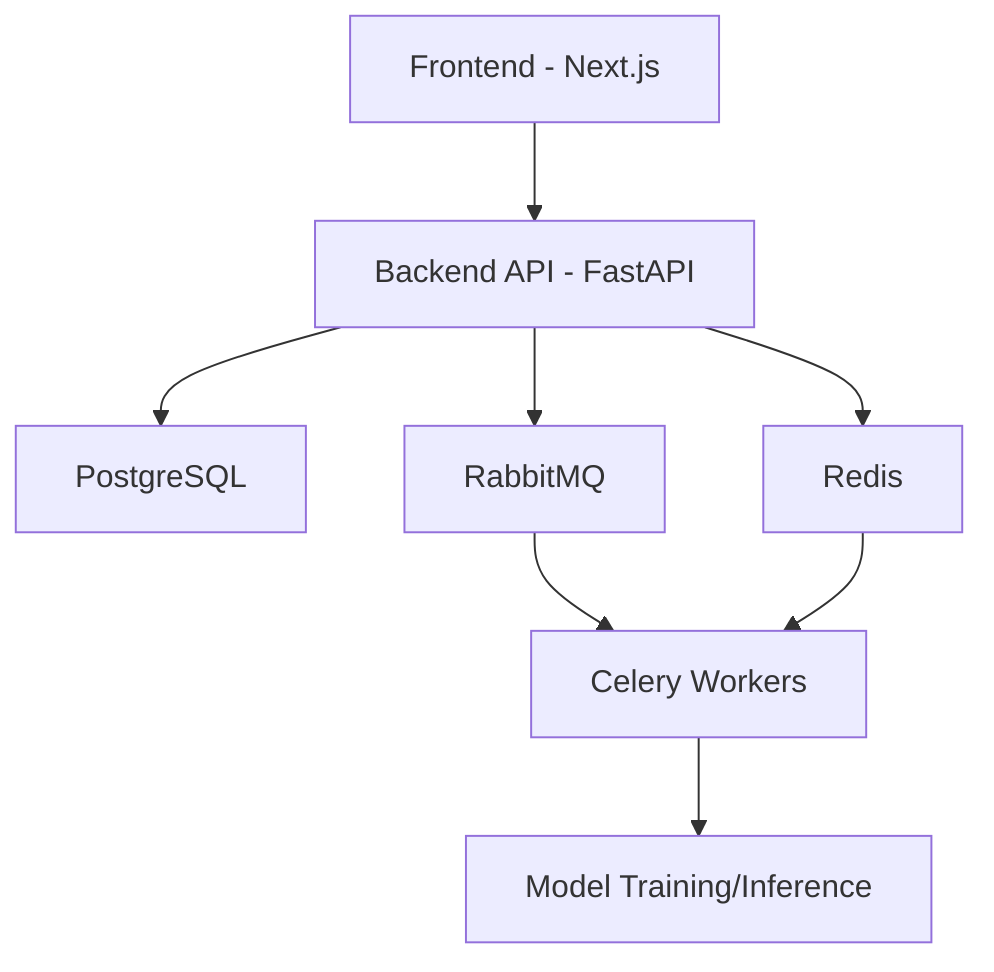

# 🏥 Ministry of Health AutoML Platform

<div align="center">
  
  
  
  
  
  
</div>

## 🎥 Video

<div align="center">
  <a href="https://github.com/user-attachments/assets/432a6f03-ca45-436d-b57b-8d17c06ed2ad" target="_blank">
    
  </a>
  <p>⚠️ ADD VIDEO LINK HERE - You can add the video link from the issue ⚠️</p>
</div>

## 🚀 Key Features

- **🧠 Integration of 3 Different AI Technologies**
  - **Machine Learning**: Classification, regression, clustering, and anomaly detection
  - **Deep Learning**: Image classification, object detection, segmentation
  - **Large Language Models**: Text classification, summarization, question answering

- **📊 Advanced Data Preprocessing and Visualization**
  - Custom healthcare data normalization options
  - Data augmentation techniques
  - Dynamic data visualization tools

- **⚙️ Model Training and Performance Monitoring**
  - Real-time training metrics monitoring
  - Distributed model training
  - Hyperparameter optimization

- **🔒 Secure Infrastructure for Healthcare Data**
  - Data-specific security protocols
  - Role-based access control
  - Data encryption


## 🏗️ System Architecture



## 💻 Technology Stack

### Frontend
- **Next.js 13**: Server-side rendering and static page generation
- **TypeScript**: Type safety
- **Tailwind CSS**: Fast and scalable CSS
- **shadcn/ui**: Modern and customizable UI components
- **Framer Motion**: Smooth animations

### Backend
- **FastAPI**: High-performance API framework
- **SQLAlchemy**: ORM (Object Relational Mapping)
- **Celery**: Asynchronous task management
- **PyTorch/TensorFlow**: Deep Learning models
- **scikit-learn**: Machine Learning algorithms

### Infrastructure
- **Docker & Docker Compose**: Containerization
- **Nginx**: Reverse proxy and load balancing
- **PostgreSQL**: Main database
- **Redis**: Cache and message broker
- **RabbitMQ**: Message queue

## 🚀 Getting Started

### Requirements
- Docker and Docker Compose
- Git

### Installation Steps

1. **Clone the repository**
   ```bash
   git clone https://github.com/ByErenOzer/Ministry-of-Health-AutoML-Frontend.git
   cd Ministry-of-Health-AutoML-Frontend
   ```

2. **Run the application with Docker**
   ```bash
   docker-compose up -d
   ```

3. **Access in your browser**
   - Frontend: http://localhost:3000
   - Backend API: http://localhost:8000
   - API Documentation: http://localhost:8000/docs
   - RabbitMQ Management Interface: http://localhost:15672

## 📊 Screenshots

<div align="center">
  
  
  <br>
  
  
</div>

## 🔍 Use Cases

### 1. Medical Image Analysis
- Anomaly detection in MRI, CT, and X-ray images
- Tumor classification and localization
- Tissue segmentation

### 2. Healthcare Data Prediction
- Patient risk assessment
- Disease progression prediction
- Drug efficacy analysis

### 3. Text-Based Medical Data Analysis
- Automatic classification of medical notes
- Literature review and summarization
- Clinical decision support systems

## 📄 License

This project is licensed by the Ministry of Health. For more information, please refer to the License file in the repository.

## 📞 Contact

Eren Özer - [@ByErenOzer](https://github.com/ByErenOzer)

Project Link: [https://github.com/ByErenOzer/Ministry-of-Health-AutoML-Frontend](https://github.com/ByErenOzer/Ministry-of-Health-AutoML-Frontend)
