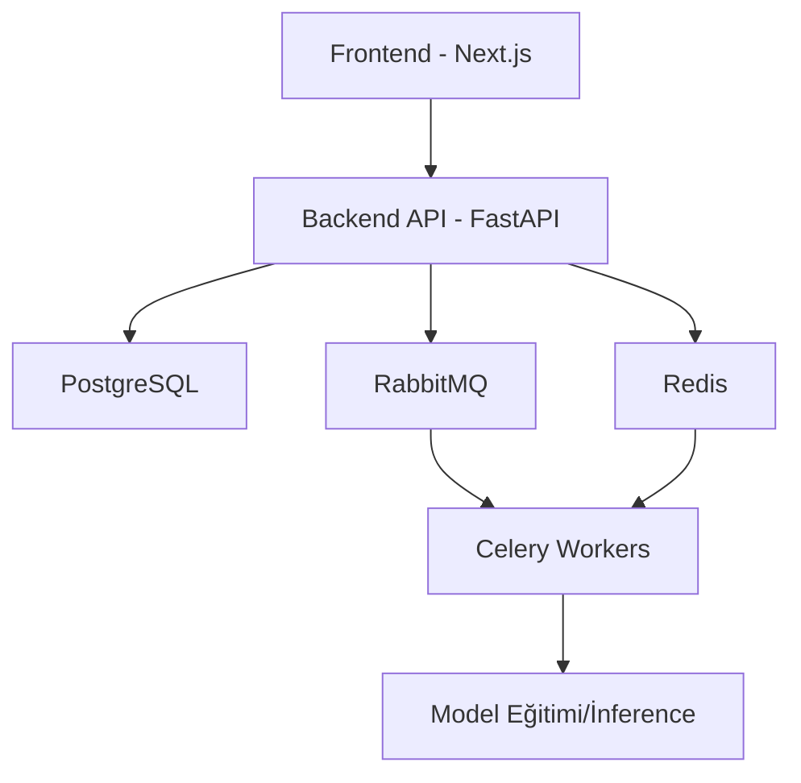

# 🏥 Sağlık Bakanlığı AutoML Platformu

<div align="center">
  
  
  
  
  
  
</div>

<div align="center">
  <h3>Sağlık verilerinin analizi ve modellenmesi için uçtan uca yapay zeka platformu</h3>
  <p>Machine Learning, Deep Learning ve Large Language Models ile sağlık verileri üzerinde akıllı analizler</p>
</div>

<p align="center">
  
</p>

## 🚀 Temel Özellikler

- **🧠 3 Farklı AI Teknolojisi Entegrasyonu**
  - **Machine Learning**: Sınıflandırma, regresyon, kümeleme ve anomali tespiti
  - **Deep Learning**: Görüntü sınıflandırma, nesne tespiti, segmentasyon
  - **Large Language Models**: Metin sınıflandırma, özetleme, soru cevaplama

- **📊 Gelişmiş Veri Ön İşleme ve Görselleştirme**
  - Özel sağlık verisi normalizasyon seçenekleri
  - Veri augmentasyon teknikleri
  - Dinamik veri görselleştirme araçları

- **⚙️ Model Eğitim ve Performans İzleme**
  - Gerçek zamanlı eğitim metriklerini izleme
  - Dağıtılmış model eğitimi
  - Hyperparameter optimizasyonu

- **🔒 Sağlık Verileri için Güvenli Altyapı**
  - Veriye özel güvenlik protokolleri
  - Role dayalı erişim kontrolü
  - Veri şifreleme

## 🎥 Video

<div align="center">
  <a href="https://github.com/user-attachments/assets/432a6f03-ca45-436d-b57b-8d17c06ed2ad" target="_blank">
    
  </a>
  <p>⚠️ İLGİLİ VİDEO LİNKİNİ BURAYA EKLEYİN - Video linkini issue'dan alarak buraya ekleyebilirsiniz ⚠️</p>
</div>

## 🏗️ Sistem Mimarisi



## 💻 Teknoloji Yığını

### Frontend
- **Next.js 13**: Server-side rendering ve statik sayfa üretimi
- **TypeScript**: Tip güvenliği
- **Tailwind CSS**: Hızlı ve ölçeklenebilir CSS
- **shadcn/ui**: Modern ve özelleştirilebilir UI bileşenleri
- **Framer Motion**: Pürüzsüz animasyonlar

### Backend
- **FastAPI**: Yüksek performanslı API framework'ü
- **SQLAlchemy**: ORM (Object Relational Mapping)
- **Celery**: Asenkron görev yönetimi
- **PyTorch/TensorFlow**: Deep Learning modelleri
- **scikit-learn**: Machine Learning algoritmaları

### Altyapı
- **Docker & Docker Compose**: Konteynerleştirme
- **Nginx**: Reverse proxy ve yük dengeleme
- **PostgreSQL**: Ana veritabanı
- **Redis**: Önbellek ve message broker
- **RabbitMQ**: Message queue

## 🚀 Başlangıç

### Gereksinimler
- Docker ve Docker Compose
- Git

### Kurulum Adımları

1. **Repoyu klonlayın**
   ```bash
   git clone https://github.com/ByErenOzer/Ministry-of-Health-AutoML-Frontend.git
   cd Ministry-of-Health-AutoML-Frontend
   ```

2. **Uygulamayı Docker ile çalıştırın**
   ```bash
   docker-compose up -d
   ```

3. **Tarayıcınızda erişin**
   - Frontend: http://localhost:3000
   - Backend API: http://localhost:8000
   - API Dokümantasyonu: http://localhost:8000/docs
   - RabbitMQ Yönetim Arayüzü: http://localhost:15672

## 🔍 Kullanım Senaryoları

### 1. Tıbbi Görüntü Analizi
- MRI, CT ve X-ray görüntülerinde anomali tespiti
- Tümör sınıflandırma ve lokalizasyonu
- Doku segmentasyonu

### 2. Sağlık Verisi Tahminleme
- Hasta risk değerlendirmesi
- Hastalık progresyon tahmini
- İlaç etkinliği analizi

### 3. Metin Tabanlı Tıbbi Veri Analizi
- Tıbbi notların otomatik sınıflandırılması
- Literatür taraması ve özet çıkarma
- Klinik karar destek sistemleri

## 🛣️ Yol Haritası

- [ ] **Federated Learning Entegrasyonu**: Kurumlar arası işbirlikçi öğrenme
- [ ] **AutoML Optimizasyonu**: Otomatik model seçimi ve hiperparametre ayarlama
- [ ] **Tıbbi Veri Görselleştirme Geliştirmeleri**: 3D görüntü analizi
- [ ] **Çoklu Dil Desteği**: Türkçe, İngilizce ve diğer diller
- [ ] **Mobil Uygulama**: iOS ve Android platformları için


## 📄 Lisans

Bu proje T.C. Sağlık Bakanlığı tarafından lisanslanmıştır. Daha fazla bilgi için lütfen reponun License dosyasını inceleyiniz.

## 📞 İletişim

Eren Özer - [@ByErenOzer](https://github.com/ByErenOzer)

Proje Linki: [https://github.com/ByErenOzer/Ministry-of-Health-AutoML-Frontend](https://github.com/ByErenOzer/Ministry-of-Health-AutoML-Frontend) 
